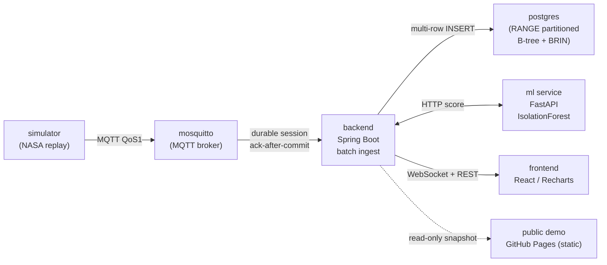

# gongjangjang — Real-time Sensor Anomaly Monitoring

[](https://github.com/sequaa/gongjangjang/actions/workflows/ci.yml)

> A smart-factory monitoring stack that ingests equipment-sensor streams over MQTT, persists them in
> pure PostgreSQL, serves live WebSocket dashboards, and runs a threshold → SPC → ML anomaly ladder.
> The point is not a shiny product but **defensible before→after numbers a skeptical interviewer can
> re-run**: ingest throughput 8.7x, query P1 3.4x, zero kill-9 restart loss, and an honest detection
> trade-off. **Every headline number is locally reproducible from a committed command** — no invented
> figures, unfavorable results reported as-is.
>
> Stack: Spring Boot (API·WebSocket·batch ingest) · FastAPI (ML) · pure PostgreSQL · React/TypeScript
> (Recharts) · Mosquitto MQTT · k6 (load).

**설비 센서 실시간 이상탐지 모니터링** — 설비 센서 데이터를 수집→저장→실시간 모니터링→이상/품질
분석→웹 관제하는 시스템. 핵심은 "재현 가능한 before→after 성능 수치"다. 아래 4개 헤드라인 수치는
모두 커밋된 명령 한 줄로 직접 재현되며, 불리한 수치도 숨기지 않고 그대로 보고한다.

## 핵심 수치

| 지표 | before (naive) | after (optimized) | 배수 / 결과 | 재현 |
|---|---|---|---|---|
| 적재 포화율 (saturation persist rate) | 6,074 rows/s | 53,116 rows/s | **8.7x** | [bench/rerun.sh](bench/rerun.sh) |
| 조회 P1 시간범위 (device+time range) | 69.757 ms | 20.702 ms | **3.4x** | [bench/query_benchmark.sh](bench/query_benchmark.sh) |
| kill-9 재시작 손실 | naive −5,270 rows | batch 0 rows | **손실 제거** | [bench/kill9-test.sh](bench/kill9-test.sh) |
| 탐지 리드타임 (동결 RMS 임계, K=3) | — | 72.17 h @ FPR 0% | **가장 방어가능** | [ml/eval/run_eval.py](ml/eval/run_eval.py) |

- 적재/조회 수치는 **같은 세션 내 2-pass / 인덱스 toggle**로 측정해 PC 사양 편차가 양쪽에 상쇄된다.
  헤드라인은 절대값이 아니라 **배수**다.
- 탐지 리드타임은 NASA IMS Bearing run-to-failure에서 고장 시각까지 남은 시간이며, 세 탐지기
  (threshold / SPC / ML)를 **동일 K로 동결·비교**한 결과다.

## 정직 보고

이 프로젝트의 신뢰 근거는 **나쁜 숫자를 그대로 보이는 것**이다. 두 개의 불리한 결과를 숨기지 않는다.

- **조회 P3 집계 0.7x 역전** — 3개월 범위 집계 쿼리(P3)는 optimized가 오히려 느리다
  (455.927 ms → 624.825 ms). 테이블 절반(~2.6M 행)을 집계하는 패턴에선 어떤 인덱스도 parallel
  seq scan을 못 이긴다. after 플랜도 before와 똑같이 Parallel Seq Scan이며, 이것은 **버그가 아니라
  옵티마이저의 올바른 선택**이다. partition pruning 자체는 동작했지만(3개 파티션만 스캔) 절반-테이블
  집계에선 그 이득이 seq scan 비용에 묻힌다.
- **ML 미승리 trade-off** — 다변량 ML(IsolationForest)은 first-touch(K=1)에서만 가장 일러
  "보이고", 지속성 K=3을 걸면 **1위→꼴찌(61.0 h)로 무너진다**. SPC는 빠르지만 healthy 구간 FPR이
  9.67%로 시끄럽다. 근본 원인은 **분포 겹침**: healthy 구간 anomaly-score 최댓값 0.2112가 전체 열화
  구간 점수의 99.12%를 초과한다 — healthy와 열화 점수 분포가 겹쳐, ML의 "조기성"은 분리 가능한
  신호가 아니라 임계선을 어디 두느냐의 운(noise 위의 운)이다. 결론: 이 RMS-지배 신호에선 **측정 전
  동결한 RMS 임계(FPR 0%, K에 안정)가 가장 방어 가능한 탐지기**다.

## 아키텍처



- **적재 경로:** simulator → mosquitto → backend(배치 flush) → postgres. broker를 내구 버퍼로 써서
  DB commit 이후에만 ack(ack-after-commit) → kill-9에도 손실 0.
- **분석 경로:** backend가 threshold·SPC를 in-process로, 다변량 ML은 FastAPI에 HTTP로 위임.
- **발표 경로:** 라이브는 WebSocket/REST, 공개 데모는 자격증명 없는 읽기 전용 정적 스냅샷.

## 트러블슈팅 서사

### 적재 처리량 8.7x
naive는 MQTT 콜백 스레드에서 메시지 한 건마다 단건 INSERT를 동기 실행해 처리량이 ~6k rows/s 천장에
막히고, knee를 넘으면 지연이 아니라 **메시지가 버려졌다**(over-offer drop 98.5%). 인메모리 bounded
버퍼 + 전용 flush 워커(N=500 / T=100ms) + JDBC multi-row INSERT로 DB 왕복을 N분의 1로 줄여 포화
적재율을 8.7x로 올렸다. 지연은 broadcast-on-receive로 flush T와 분리해 p99 9ms를 유지했다.
전문: [docs/perf/02-ingestion-spike.md](docs/perf/02-ingestion-spike.md)

### 조회 인덱스/파티션 (3.4x, P3 역전 정직)
인덱스도 파티션도 없는 단일 테이블에선 3대표 read 패턴이 모두 풀스캔 + 디스크 정렬(P2 240MB)로
떨어졌다. **TimescaleDB 같은 확장 없이 순수 PostgreSQL native**(RANGE 월 파티션 + 복합 B-tree +
BRIN)만 쌓아 P1 시간범위 3.4x, P2 최신값 2.7x(디스크 정렬 → ordered index scan)를 얻었다. lever
분해로 지연의 주 레버는 **인덱스**이고 파티셔닝은 이 규모에선 지연 중립(가치는 운영 retention)임을
측정으로 구분했으며, P3 집계 0.7x 역전도 그대로 보고한다.
전문: [docs/perf/02-query-spike.md](docs/perf/02-query-spike.md)

### 안정성 (kill-9 손실 0 / soak / 동접)
QoS1 + `cleanSession=false` + ack-after-commit 설계로 백엔드를 SIGKILL한 뒤 재시작해도 broker가
미-ack 메시지를 재전송해 **손실 0**(batch 29,988/29,988 vs naive −5,270). 손실 0의 보장원은 컨테이너
파일시스템이 아니라 broker의 durable session이다. 30분 soak에서 메모리는 +3.8%로 flat(누수 없음),
동접 50 VU HTTP 조회(실패 0%, p95 5.29ms)와 20 VU WebSocket(2.86M 메시지 수신)을 처리했다.
전문: [docs/perf/02-stability.md](docs/perf/02-stability.md)

### 탐지 사다리 (임계 → SPC → ML, 동결 RMS 임계가 최방어)
같은 고장 데이터에서 임계치·SPC·ML을 측정 전 동결한 한계로 비교했다. 서사상 위로 갈수록 "더 많이
보지만"(RMS 레벨 → 추세/공정능력 → 다변량 결합), 이 RMS-지배 신호에선 정교화가 robust한 이득을 주지
못했다. 지속성 K=3에서 ML은 꼴찌(61 h)로 무너지고 SPC는 FPR 9.67%로 시끄러운 반면, **측정 전 동결한
RMS 임계만 FPR 0%로 K를 올려도 흔들리지 않아(538→550→557) 가장 방어 가능**하다.
전문: [docs/anomaly/03-detection-ladder.md](docs/anomaly/03-detection-ladder.md)

## 라이브 데모 vs 재현

실배포는 대시보드 전체를 JWT 뒤에 둠(`/login`); 공개 데모는 자격증명 없이 평가하도록 읽기 전용 스냅샷으로 분리.

데모 URL의 임무는 수치의 출처가 아니라 **"정말 움직인다"는 시각 증거**이고, 방어 가능한 수치는 로컬
`bench/`·`ml/eval/run_eval.py`로 재현한다. 이 분리 자체가 면접 방어 포인트다.

- **라이브 데모(읽기 전용 정적 재생):** [https://sequaa.github.io/gongjangjang/](https://sequaa.github.io/gongjangjang/)
  — 차트가 시간진행으로 움직이고 알람이 시간순 등장. 자격증명·백엔드 불필요.

## 실행 방법

**원클릭 풀스택 기동**(면접관이 재현하는 "현실 자세" — 대시보드는 `/login` JWT 뒤):

```bash
# mosquitto + postgres + backend + ml(FastAPI) + simulator(NASA replay) + frontend
docker compose -f infra/docker-compose.yml --env-file .env up --build
# frontend: http://localhost:5173  (admin 자격증명은 .env의 키로 주입)
```

시크릿은 `.env`의 키 이름으로만 주입한다(값은 저장소에 넣지 않음).

**로컬 수치 재현**(위 헤드라인 표의 출처):

```bash
# 적재 8.7x / knee — before(naive) vs after(batch) 같은 세션 2-pass
git checkout perf/01-naive-baseline && bench/rerun.sh
git checkout main && bench/rerun.sh

# kill-9 재시작 손실 0 vs -5,270
bash bench/kill9-test.sh

# 조회 3.4x / P3 0.7x 역전 — 같은 5M 행 위 인덱스 toggle
bash bench/query_benchmark.sh

# 탐지 사다리 리드타임 / FPR / 튜닝 후보(패자 포함)
python ml/eval/run_eval.py
```

모든 헤드라인 수치는 `bench/results/`·`ml/eval/results/`의 커밋된 산출물에서 그대로 인용한 값이다.
